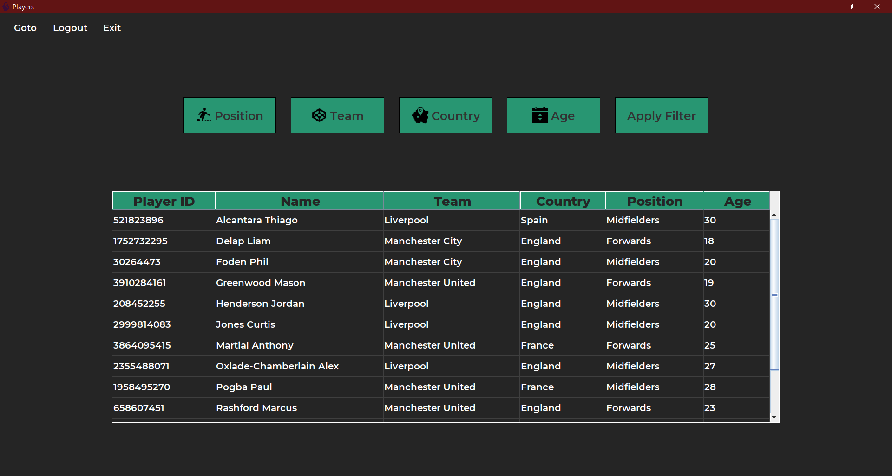

# Football Manager

A desktop application which can be used by football managers to manage their team, and the transfer market.

- View current league standings
- View top scorers of the league
- View recent results of all teams
- View upcoming fixtures of all teams
- View all players (filter by position, country, age and team)
- View player data
- Make transfer request (permanent, loan and player exchange)
- View Incoming/Outgoing Transfer Requests
- Accept/Reject Transfer Requests

## Setup

### Download and Installation

- [Install Java](https://www.youtube.com/watch?v=IJ-PJbvJBGs)
- [Download and Install MySQL](https://www.youtube.com/watch?v=WuBcTJnIuzo)
- Clone and open the project in any Java IDE ([IntelliJ](https://www.jetbrains.com/idea/download/))

### Setting up dependencies (External JAR)

- Add the external JAR files in the folder ```External JARs``` to your project.

### Setting up API Key

- Get API Key from
    - [API Football](https://apifootball.com/) (used to populate managers, teams, players, league standings and top
      scorers)
    - [Football Data](https://www.football-data.org/) (used to populate fixtures and results)


- In the file ```src/com/api/API.java```, enter your two API keys from [API Football](https://apifootball.com/)
  and [Football Data](https://www.football-data.org/).
  

- ```API_FOOTBALL_DATA_ORG_API_KEY```
  

- ```API_FOOTBALL_COM_API_KEY```

### Setting up MySQL database

- In the file ```src/com/sql/SQL.java```, enter your MySQL database credentials (host, port number, database, user and
  password)
    - ```host```
    - ```portNo```
    - ```database```
    - ```user```
    - ```password```
  


- Execute all the SQL statements in the file ```src/setup/query.sql```

### Populate Data

- Run the file ```src/setup/Setup.java``` which will populate all the required data from the API into the database (it
  takes time).

### Launching the application

- To launch the application, run the ```src/com/football_manager/Main.java``` after setting up all the requirements
  listed above.
- Password for all managers is ```samplepwd```

## Screenshots

Login | Dashboard
------------ | -------------
 | 

League Standings | Top Scorers
------------ | -------------
 | 

Results | Fixtures
------------ | -------------
 | 

Players | Filter by Position
------------ | -------------
 | 

Filter by Country | Filter by Team
------------ | -------------
 | 

Filter by Age | Players After Filter
------------ | -------------
 | 

Player Data | Transfer Type
------------ | -------------
 | 

Permanent Transfer | Loan Transfer
------------ | -------------
 | 

Player Exchange Transfer | Outgoing Transfer Requests
------------ | -------------
 | 

Incoming Transfer Requests | Accept/Reject Transfer
------------ | -------------
 | 

 
